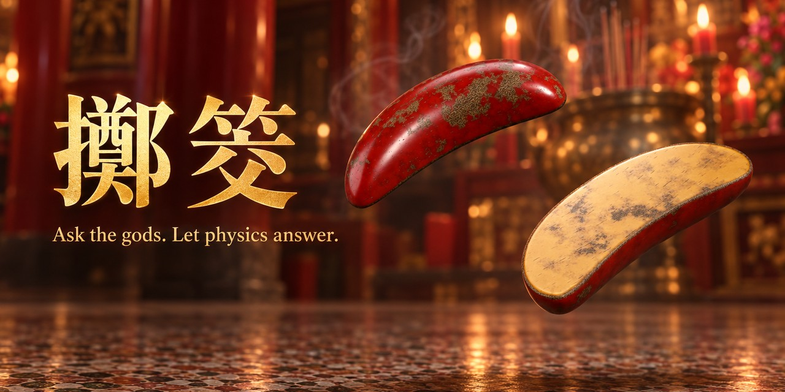

# 擲筊 · jiaobei

> Ask the gods a yes-or-no question. Get your answer from a rigid-body physics engine running at 240 Hz.
> Theologically questionable. Numerically stable.



**🏮 Throw some blocks: <https://davidyen1124.github.io/jiaobei/>**

## What is this?

擲筊 (*jiaobei*, Taiwanese *poah-poe* 跋桮) is how you ask a deity a yes/no question in a Taiwanese temple. You take two crescent-shaped wooden blocks, each flat on one side and round on the other. You tell the god who you are and what you want to know, then drop the blocks on the floor. How they land is the answer.

This repo turns that into a web page. It has a path-traced temple hall, lacquered blocks modelled from museum specimens, real rigid-body physics, and synthesized wooden *clack* sounds. You no longer have to leave the house to be told "no" by a higher power.

## How to read the blocks

| Result | How they land | What the god said | Translation |
|---|---|---|---|
| **聖筊** (holy) | one flat side up, one round side up | Yes. | Go ahead. Don't make it weird. |
| **笑筊** (laughing) | both flat sides up | *laughs, says nothing* | Your question was vague. Try again, and use your words this time. |
| **陰筊** (no) | both round sides up | No. | The universe has left you on read. |
| **立筊** (standing) | a block lands standing on its edge | 😳 | Extremely rare. Take a screenshot, because nobody will believe you. |

Three 聖筊 in a row (三聖筊) means the answer is *really* yes. The app keeps count for you, so there's no cheating. (It's also on your conscience.)

## How to throw

1. Press your palms together. Silently state your name, lunar birthday, and home address.
   *The website doesn't collect any of this. The gods have their own database.*
2. Ask **one** question. One. Not "should I quit my job and also is my ex thinking about me".
3. Tap the screen. The blocks go up. Physics does the rest.

## FAQ

**Is this real divination?**
The physics is real. Whether the deities have root access to a WASM module is between you and them.

**Can I keep throwing until I get a yes?**
Technically, yes. Spiritually, the gods can see your browser history.

**What are the odds?**
400 seeded throws in the simulator gave:

| 聖 yes | 笑 laugh | 陰 no | 立 standing |
|---|---|---|---|
| 52.0% | 28.0% | 20.0% | 0.0% |

A real 1,000-toss science-fair experiment also landed around 50% 聖筊. So divine approval is roughly a coin flip, which explains a lot.

**I got 立筊.**
No you didn't.

**It said no. Can I file an appeal?**
Appeals are processed in the order they're received, at the next 元宵 (Lantern Festival).

## What's inside

- **Rendering:** [three.js](https://threejs.org/). Blender Cycles path-traces the temple hall into a panorama plus an HDR light probe taken at the landing spot. Only the blocks are real-time 3D. Both use the same *Khronos PBR Neutral* tone curve, so the blocks don't look pasted onto the background.
- **Physics:** [Rapier](https://rapier.rs/) (WASM) steps at 240 Hz with colliders exported from the Blender model. Each block is 11.7 × 5.2 × 2.28 cm and weighs 44.6 g, like lacquered camphor wood on honed granite. The size is based on specimens in the National Taiwan Museum.
- **Sound:** there are no audio files. Every contact impulse from the physics engine becomes a modal-synthesis *clack*: a click, the block's resonant modes, and a low thump from the stone floor. A convolution reverb models a stone-and-timber hall.
- **Social card and favicon:** generated by Codex CLI with its built-in `imagegen` skill. The two blocks in the favicon face each other, which makes it the only 聖筊 you'll ever get on the first try.
- **Research:** [RESEARCH.md](RESEARCH.md) covers the shape, finish, ritual, readings, and the Dajia Mazu pilgrimage whose date is set by throwing blocks. It draws on about 60 sources, from temple websites to museum catalogues.

## Run it locally

```bash
npm install
npm run dev        # http://localhost:5173
npm run build      # static site in dist/
npm run sim -- 400 # 400 headless throws, prints the odds above
```

Useful URL parameters: `?seed=42` replays the same throw every time, and `?manual` pauses the clock so scripts can step it.

The `blender/` scripts generate the blocks, the temple panorama, the light probe, and the colliders into `public/assets/`. The rendered results are committed, so you don't need Blender to run the site.

## Deploying

Pushing to `main` runs [a GitHub Actions workflow](.github/workflows/pages.yml) that builds with Vite and publishes `dist/` to GitHub Pages. The build uses relative paths (`base: './'`), so it works at any sub-path.

## Disclaimer

This project is not affiliated with any temple, deity, or celestial bureaucracy. It's for fun and for learning about the tradition. For decisions that matter, go to a real temple, light real incense, and let a real floor do its job.

No actual 筊杯 were harmed in the making of this site. About 400 virtual ones were dropped repeatedly for science.
